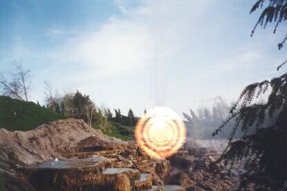



## Masked Light

### Description

Well, since the first "Light" demo project came out so good, I had to make another one ;)

This one has a difference: instead of drawing a light with the specified radius, it draws a light based on a mask image. The Radius now only controls the size of the glow effect. It's also just a bit faster (remember, I'm just about to learn DirectX to enhance these effects even more!).
 
### More Info
 
Call the function and it will draw it all for you! You don't need to understand the code, if you're looking for how to make your own algorythms, the "Light Effects" sample is much easier and well commented. Still, this one would be good for a game or a painting program anyway.

             |
---                |---
**Submitted On**   |2000-07-20 01:18:14
**By**             |[Jotaf98](https://github.com/Planet-Source-Code/PSCIndex/blob/master/ByAuthor/jotaf98.md)
**Level**          |Intermediate
**User Rating**    |4.7 (33 globes from 7 users)
**Compatibility**  |VB 3\.0, VB 4\.0 \(16\-bit\), VB 4\.0 \(32\-bit\), VB 5\.0, VB 6\.0
**Category**       |[Graphics](https://github.com/Planet-Source-Code/PSCIndex/blob/master/ByCategory/graphics__1-46.md)
**World**          |[Visual Basic](https://github.com/Planet-Source-Code/PSCIndex/blob/master/ByWorld/visual-basic.md)
**Archive File**   |[CODE\_UPLOAD80287222000\.zip](https://github.com/Planet-Source-Code/jotaf98-masked-light__1-9965/archive/master.zip)

